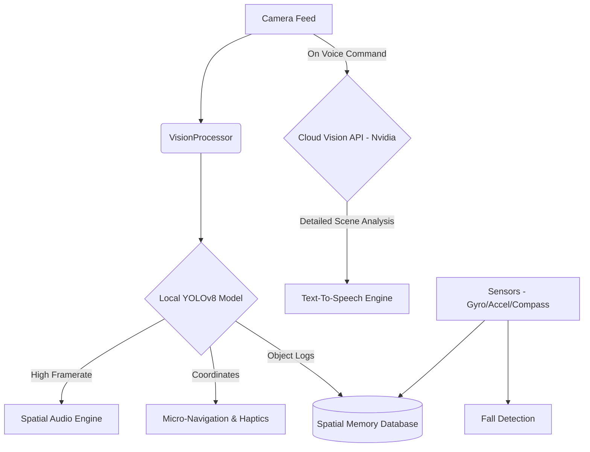
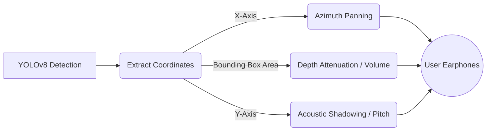
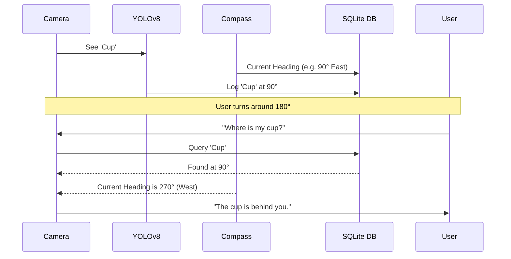
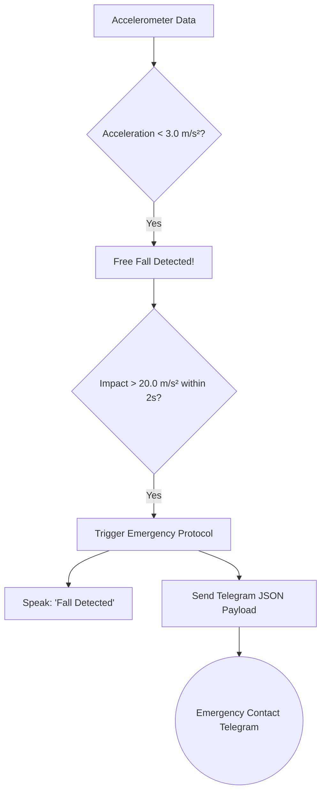

# 👁️ Smart Blind Stick - Next-Gen Android Application

  

A revolutionary, AI-powered Android application designed to assist visually impaired individuals. This application transforms a standard smartphone into an incredibly advanced, context-aware navigational and environmental analysis tool.

---

## 🌟 Key Features

*   **🎙️ Intelligent Voice Assistant:** Fully voice-controlled interface for hands-free operation.
*   **🧠 Cloud Vision AI (Nvidia/Llama):** Deep environmental analysis, room layout description (3x3 grid localization), and complex scene understanding.
*   **📷 Real-Time Object Tracking (YOLOv8):** Instantaneous, offline object detection running at high framerates using TensorFlow Lite.
*   **🎧 True 3D Spatial Audio:** Acoustic shadowing, distance attenuation, and continuous panning to create a highly accurate auditory map of the environment.
*   **📍 Dynamic Spatial Memory:** The app remembers the exact global coordinates of objects you walk past using the compass, allowing you to ask "Where is my cup?" even if it's behind you.
*   **🔍 Micro-Navigation (Find Mode):** Ask the app to "Find a door" or "Find a seat", and it will guide you using haptic feedback and spatial audio.
*   **🚨 Fall Detection & Telegram SOS:** Automatically detects free-falls followed by impacts. Triggers an instant SOS message to a predefined Telegram chat.
*   **🔦 Auto-Flashlight:** Intelligently turns on in dark rooms and turns off in bright environments using camera luminance data and hysteresis.
*   **📖 OCR (Optical Character Recognition):** Reads books, signs, and screens out loud.

---

## 🏗️ System Architecture & Flowcharts

The application relies on a dual-tier AI processing system: a **Local Edge AI** (YOLOv8) for zero-latency physical feedback, and a **Cloud LLM AI** (Nvidia Vision) for semantic reasoning.

### 1. High-Level Processing Flow

### 2. True 3D Spatial Audio Workflow

The spatial audio engine maps visual objects to a 3D acoustic space.

### 3. Dynamic Spatial Memory

How the app remembers objects that are no longer in the camera frame.

### 4. Fall Detection & SOS

---

## 🛠️ Tech Stack
*   **Language:** Kotlin
*   **UI Framework:** Jetpack Compose
*   **Machine Learning:** TensorFlow Lite (YOLOv8), Google ML Kit (OCR/Face Detection)
*   **Cloud AI:** Nvidia / Meta LLaMA Vision APIs
*   **Database:** Room (SQLite)
*   **Hardware Sensors:** CameraX, Accelerometer, Magnetometer (Compass)
*   **Networking:** OkHttp, Coroutines

## 🚀 Setup & Installation
1. Clone this repository.
2. Open the project in **Android Studio**.
3. Let Gradle sync and download dependencies.
4. Replace `<YOUR_API_KEY>` in `NvidiaApiClient.kt` (if applicable).
5. Build and Run on a physical Android device (Sensors and Camera are required).

## 📝 Voice Commands
- *"Describe what you see"* - Triggers Cloud AI for a full room layout.
- *"Find a [object]"* - Triggers Micro-navigation tracking.
- *"Where is my [object]"* - Checks local spatial memory database.
- *"Read"* - Reads text aloud.
- *"Turn off flashlight"* / *"Automatic flashlight"* - Controls the auto-light system.
- *"Switch to spatial"* - Enables 3D audio feedback.

---
*Developed for the betterment of accessibility technology.*
